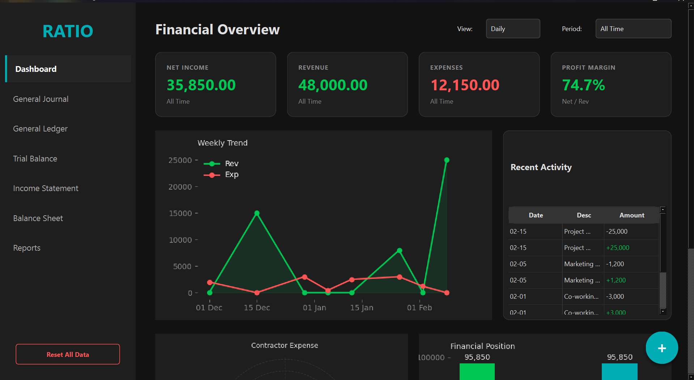
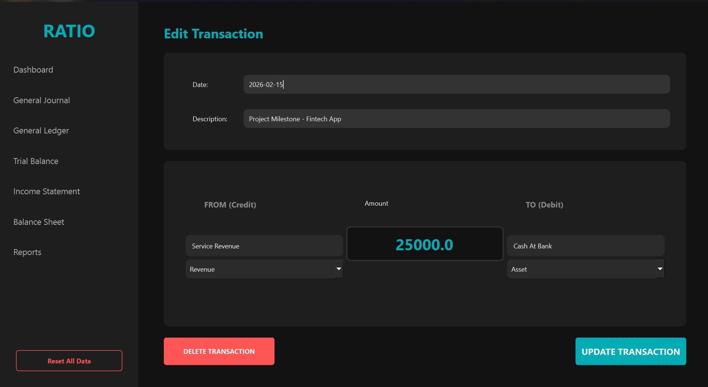
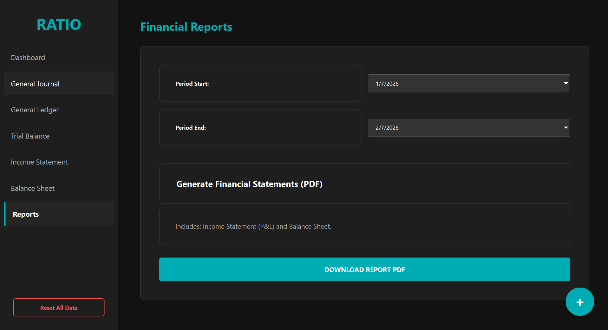

# RATIO – Financial Accounting Application

RATIO is a desktop-based financial accounting application built with Python and PyQt6.  
It uses a **double-entry bookkeeping system** to record transactions and generate standard financial statements.

The application stores data locally using SQLite and provides visual summaries and PDF-based financial reports.

---

## Features

### Accounting
- Double-entry journal system (Debit / Credit)
- Automatic balance validation
- Support for Assets, Liabilities, Equity, Revenue, and Expenses

### Financial Statements
- General Ledger  
- Trial Balance  
- Income Statement (Profit & Loss)  
- Balance Sheet  

### Dashboard & Analytics
- Overview of revenue, expenses, and net income
- Charts for cash flow, expense distribution, and net worth

### Reporting
- Export financial reports to PDF
- Formatted statements and transaction summaries

---
## Screenshots

### Dashboard


### Journal Entry


### Reports


---

## Installation (End Users)

1. Open the **Releases** section of this repository.
2. Download the latest `Ratio.exe`.
3. Run the executable.

> The application automatically creates a local `ratio.db` file to store data.

---

## Running from Source (Developers)

### Requirements
- Python 3.10 or later
- pip

### Setup

```bash
git clone https://github.com/f0rtron/Ratio.git
cd Ratio
pip install PyQt6 matplotlib reportlab sqlite3
Run
python main.py
```
## Tech Stack

- Python  
- PyQt6  
- SQLite  
- Matplotlib  
- ReportLab  

## License

This project is available for educational and personal use.
